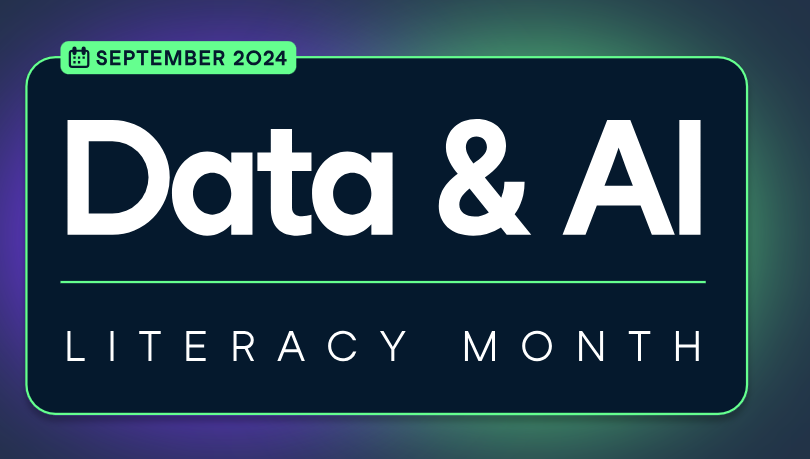

# Datacamp - Building a Data Mindset:  How to Think Like a Data Scientist

_Part of [Data Literacy Month](https://www.datacamp.com/data-literacy-month) at datacamp._

September 4, 11am American EST  
Dave Wentzel  
Microsoft - Innovation Hub - Philadelphia  
[LinkedIn Profile](https://linkedin.com/in/dwentzel)  

## Abstract

Learn how to think like a data professional - unpack core data jargon, see the data science workflow in action, and see how data can be used to solve business and real-life problems.  

Intended audience:  anyone interested in understanding how to use _data_ to make informed decisions.  

## Content

Traditionally, when IT and data folks talk about "using data to solve business problems", it's usually in the context of building dashboards, modeling data, moving data around the IT ecosystem (known as ETL:  Extract Transform and Loading data), and securing data.  Most data scientists, instead, think more about the PROCESS of problem solving. 

[Slides (Powerpoint)](./DataLiteracy-Datacamp-ThinkingLikeADataScientist.pptx)  for today.  

[Slides (pdf version)](./DataLiteracy-Datacamp-ThinkingLikeADataScientist.pdf)

## Supplementary Jupyter Notebooks

These are examples that build upon the session today.

Jupyter notebooks are the tool-of-choice that data scientists use to _make data tell a story_.  Jupyter notebooks are designed for anyone to use to solve a business problem.  Are you new to Jupyter and using notebooks to solve problems?  I have an [entire github repository](https://github.com/davew-msft/notebooks-everywhere) dedicated to learning Jupyter notebooks and displaying the power of notebooks to solve problems.  

Each of these examples illustrate how a data scientist begins to think about a business problem by using data in interesting ways.  

* [Social Media Campaign Analytics](./SocialMediaCampaignAnalytics.ipynb)
  * How to think through a problem given a set of data
  * Business Problem:  Given a set of survey results, should we invest more money in Facebook marketing campaigns?  
* [Avoiding Cognitive Mistakes with Data](./CognitiveMistakes.ipynb)
  * Using a simple dataset, demonstrate how _the average_ is not always the right way to look at a problem.  
  * Business Problem:  We need to make a large capital equipment purchase based on the results of testing 4 different pieces of heavy equipment.  Just looking at the data, which piece of equipment should we buy, and why?  
* [Behavioral Analytics](./Behavioral_Analytics.ipynb)
  * We talked about Predictive and Prescriptive Analytics today.  The next phase of the journey is _how do we actually modify our customers' behaviors so they do what is in OUR best interest_.  
  * We also look at the role of `confounding variables`
  * Business Problem:  using convenience store ice cream sales data we will look at how to improve sales and how we can subtley use data to influence purchasing decisions.  
* [Calculating Customer Lifetime Value (LTV or CLV)](./CustomerLifetimeValue.ipynb)  
  * In many engagements I do the concept of _customer lifetime value_ comes up.  We need to understand who are most important customers are.  The problem is, there are many ways to calculate CLV.  In this notebook I'll show you some ways to think about the problem.  
  * Business Problem:  As an international retailer, how might I calculate the CLV for each of my customers?  
* [Customer Churn Analytics](./ChurnAnalytics.ipynb)
  * Business Problem:  Customer "churn" affects every business's profitability.  What are some approaches to analyze churn?  

## Additional Resources

* [This Code Repository](https://github.com/davew-msft/datacamp)
* [Datacamp Data Literacy Month](https://www.datacamp.com/data-literacy-month)
